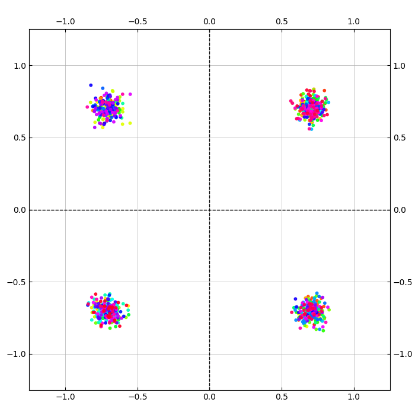
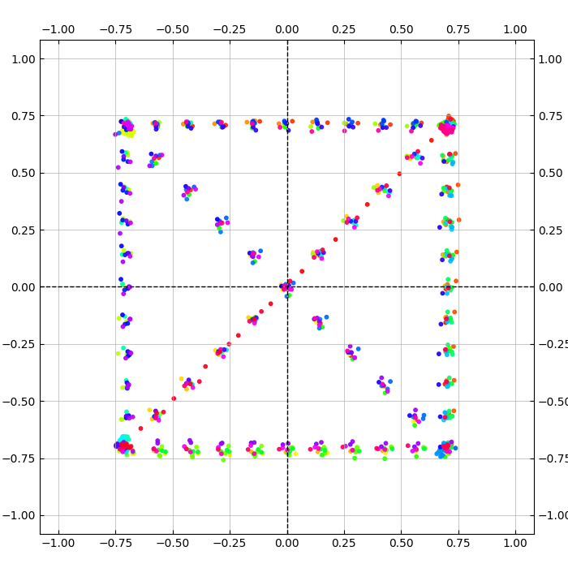
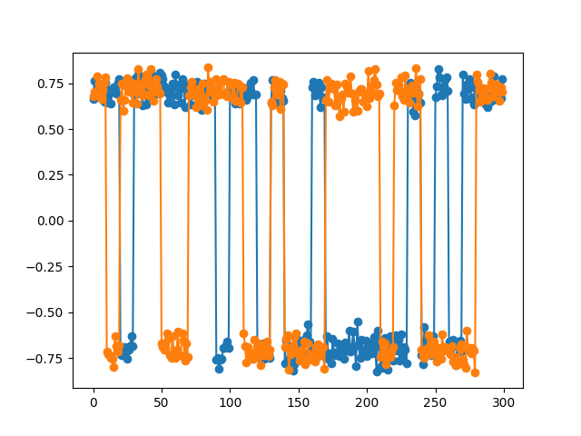
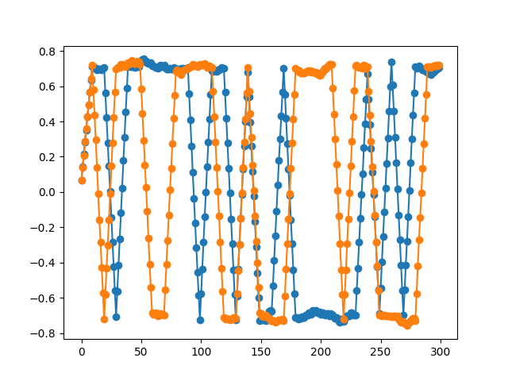
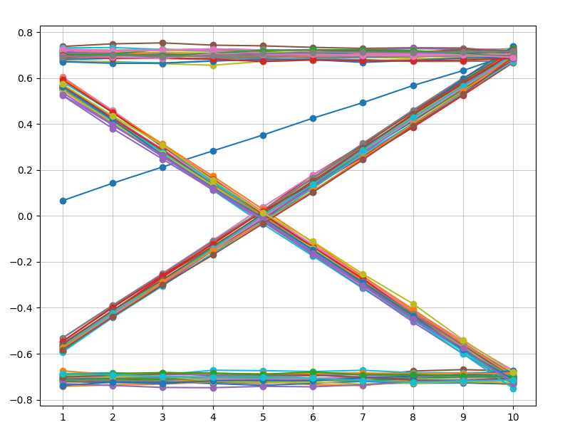

### [Моя библиотека для SDR](https://github.com/Nicoskin/mylib_python) !ВАЖНО для запуска!

## Что сделано

QPSK с шумом

    

QPSK после свёртки

   

QPSK(временной) обычный

   

QPSK(временной) после свёртки

   

Глазковая диаграмма

   