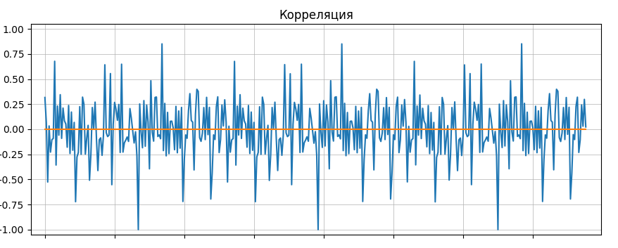
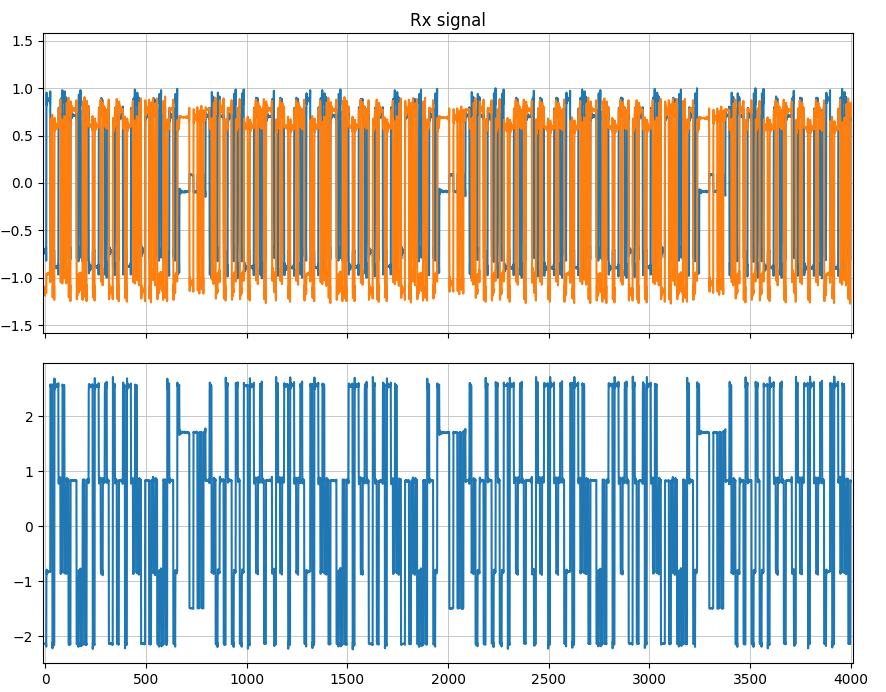
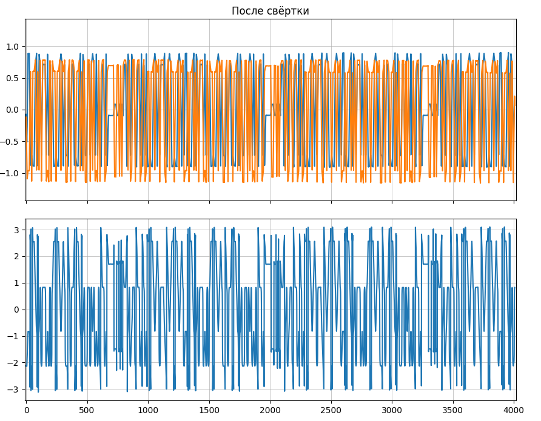
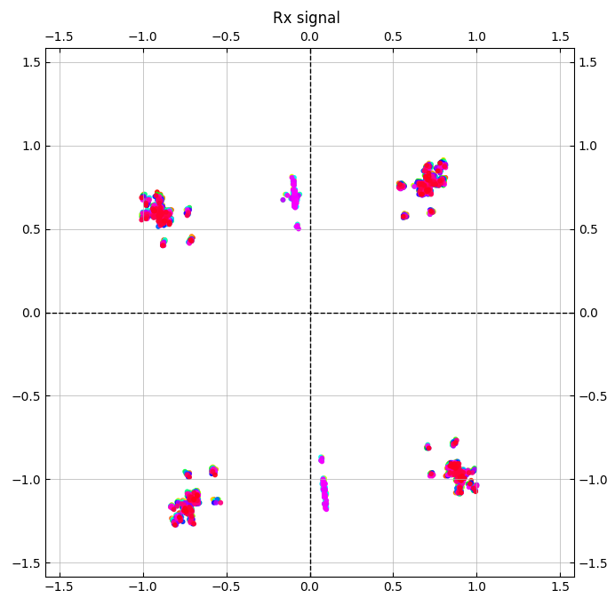
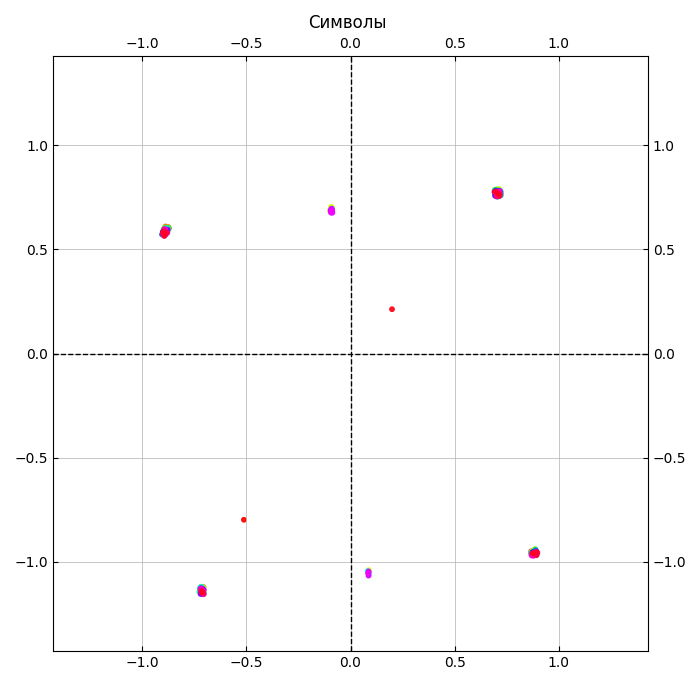
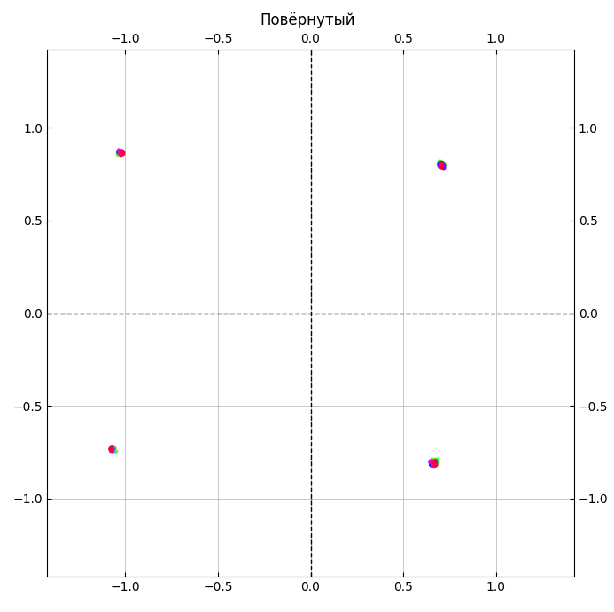
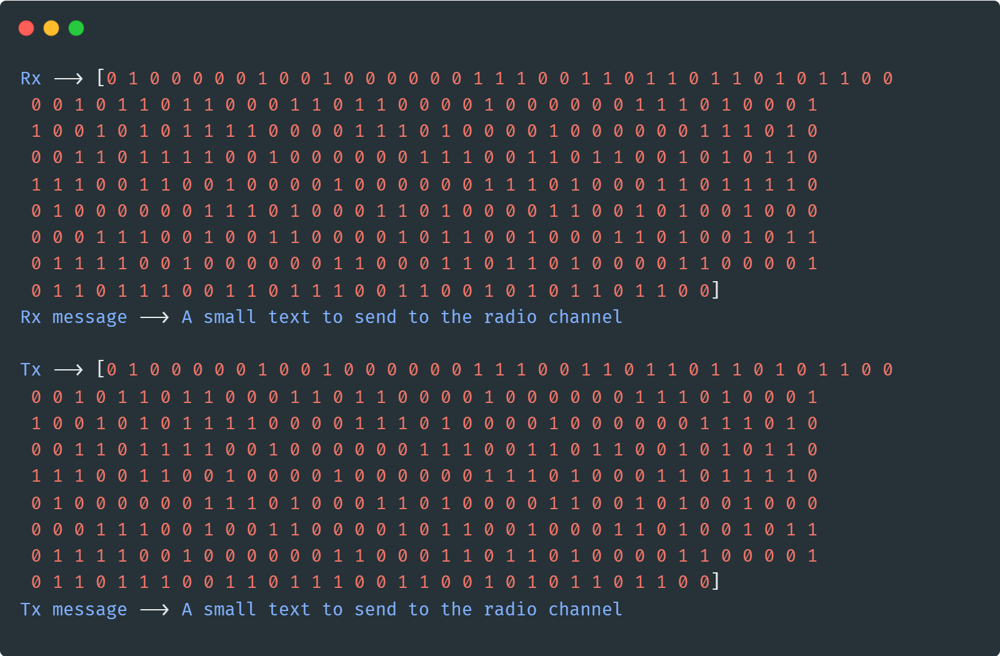

### [Моя библиотека для SDR](https://github.com/Nicoskin/mylib_python) !ВАЖНО для запуска!

## Что сделано

- [x] 1. Создание данных и синхронизации(баркер 13)   
- [x] 2. Модуляция данный по qpsk и bpsk(синхронизации) 
- [x] 3. Передача данных
- [x] 4. Приём сигнала
- [x] 5. Свёртка сигнала с N единиц (N - длинна символа)
- [ ] 6. TED
- [ ] 7. Loop filter
- [ ] 8. Interpolation control 
- [ ] 9. Interpolator
- [x] 10. Нахождение синхронизации
- [x] 11. Разворот на правильный угол по синхронизации
- [x] 12. Демодулирование qpsk сигнала
- [x] 13. Декодирование полученных бит

   

(Сверху сигнал, снизу угол каждой точки)    
   

   

   

   

   

Что отправили, что приняли и как декодировали       
   
